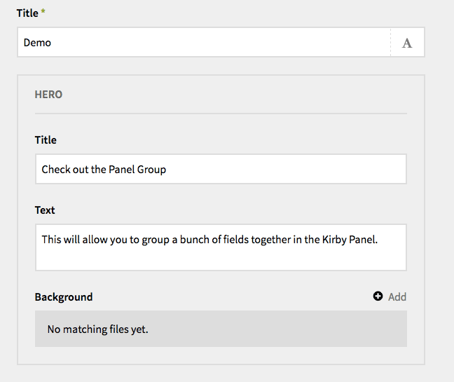

# Kirby - Panel Group

This is a custom field which can be added to the [Kirby CMS](http://getkirby.com) to allow grouping of Panel fields. It is a pure astetic customization and has no impact on your actual website. Built for Kirby 2.

## Preview




## Installation

To install, copy the contents of this repistory into site/fields/panelgroup, or follow the GIT Submodule instructions below.

## Basic Blueprint

You must "start" and "end" your group to tell the Panel which fields are inside the group.

```
fields:

  title:
    label: Title
    type:  text

  group_start:
    label: My Group
    type: panelgroup
    position: start
  some_title:
    label: Title
    type:  text
  some_text:
    label: Text
    type:  textarea
  group_end:
    type: panelgroup
    position: end

```

## Advanced Blueprint

You can also configure each panel to collapse/expand as accordians. For large pages this cleans up the Kirby Panel interface quite a bit.

```
fields:

  title:
    label: Title
    type:  text

  group_start:
    label: My Accordian Group
    type: panelgroup
    position: start
    accordian: true
  some_title:
    label: Title
    type:  text
  some_text:
    label: Text
    type:  textarea
  group_end:
    type: panelgroup
    position: end

  group_2_start:
    label: Another Accordian Group
    type: panelgroup
    position: start
    accordian: true
  another_title:
    label: Another Title
    type:  text
  group_2_end:
    type: panelgroup
    position: end


```

### Git Submodule

If you are an advanced user and know your way around Git and you already use Git to manage you project, you can make updating this field extension to newer releases a breeze by adding it as a Git submodule.

```bash
$ cd your/project/root
$ git submodule add git@github.com:louiswalch/kirby-panel-group.git site/fields/panelgroup
```

Updating all your Git submodules (eg. the Kirby core modules and any extensions added as submodules) to their latest version, all you need to do is to run these two Git commands.

```bash
$ cd your/project/root
$ git submodule foreach --recursive git checkout master
$ git submodule foreach --recursive git pull
