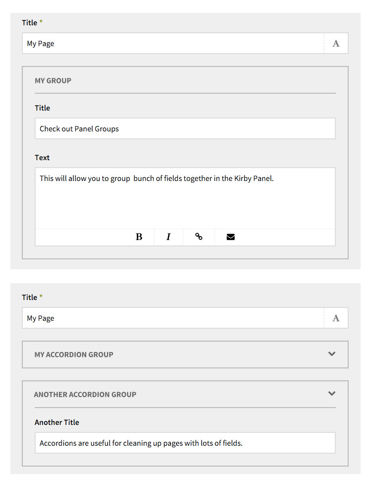

# Kirby - Panel Group

This is a custom field which can be added to the [Kirby CMS](http://getkirby.com) to allow grouping of Panel fields. It is a pure astetic customization and has no impact on your actual website. Built for Kirby 2.

## Preview




## Installation

To install, copy the `panelgroup` folder into site/fields.

## Blueprint

You must "start" and "end" your group to tell the Panel which fields are inside the group.

```
fields:

  title:
    label: Title
    type:  text

  group_start:
    label: My Group
    type: panelgroup
    position: start
  some_title:
    label: Title
    type:  text
  some_text:
    label: Text
    type:  textarea
  group_end:
    type: panelgroup
    position: end

```
